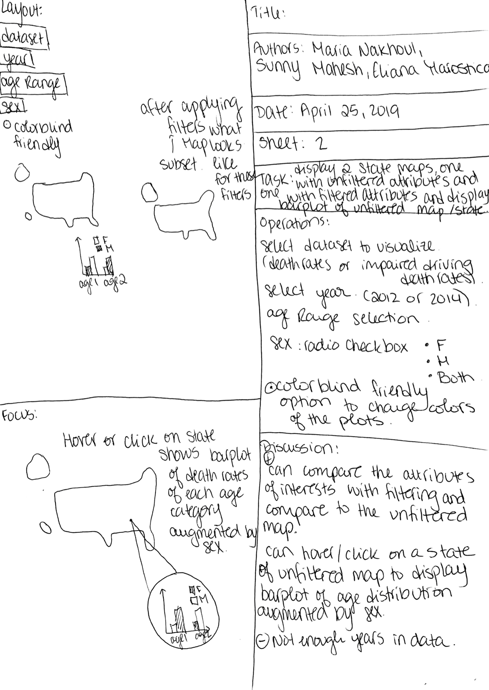
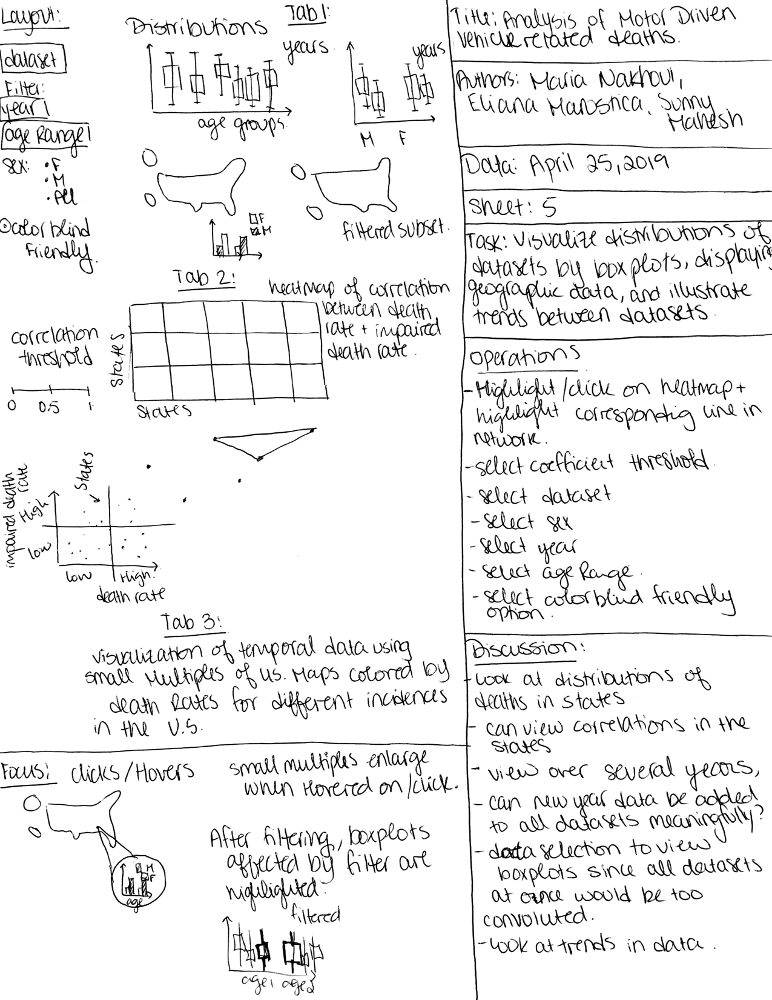
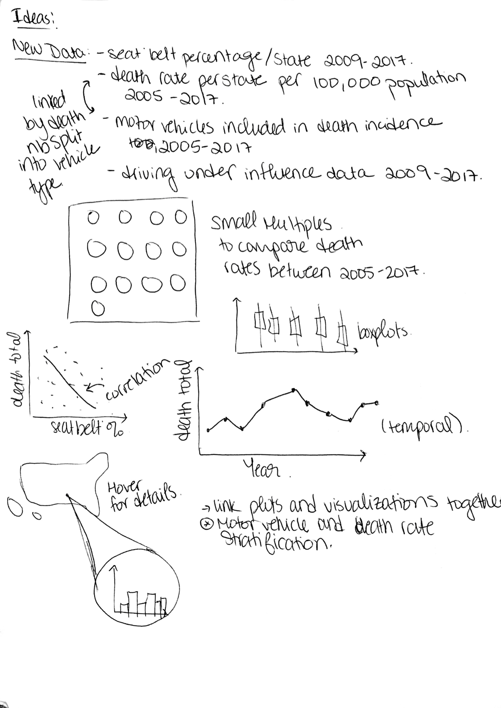
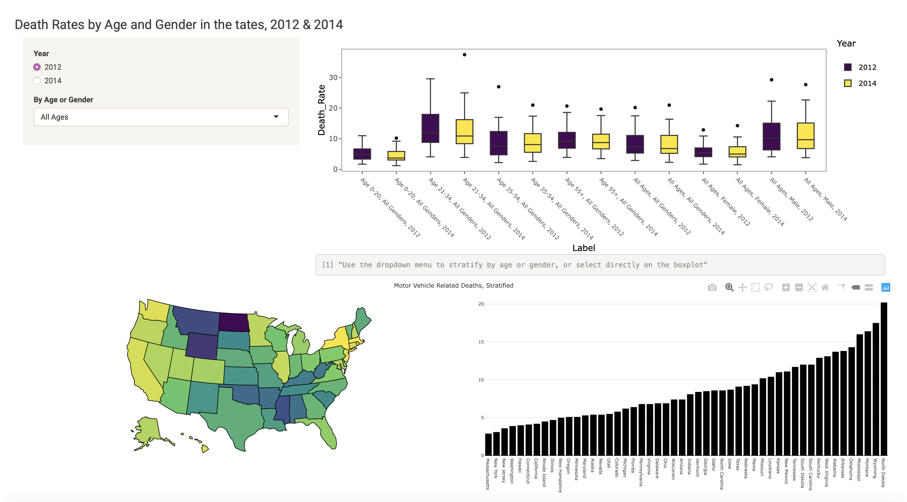
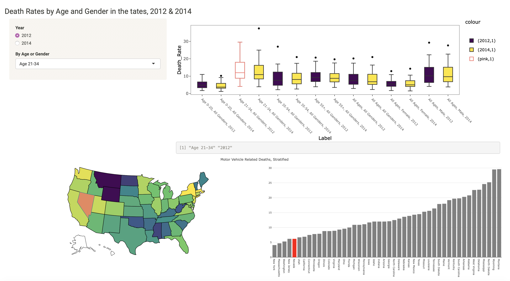
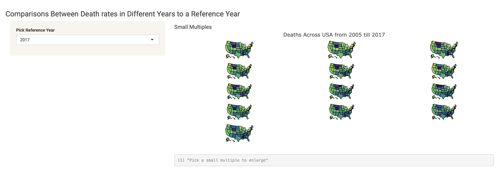
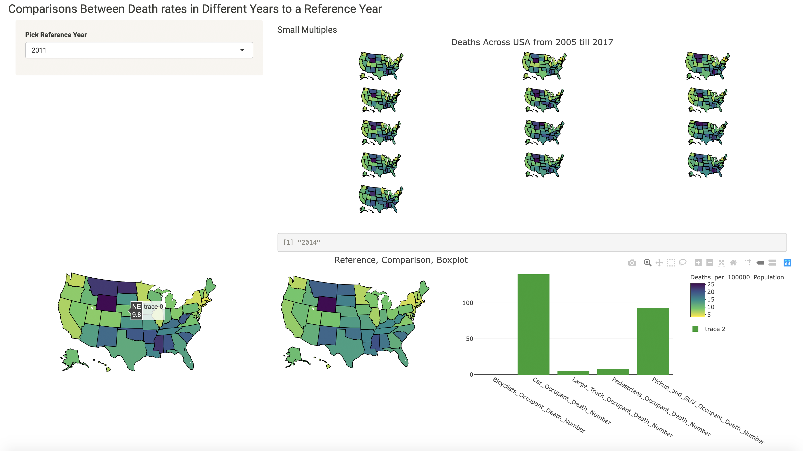
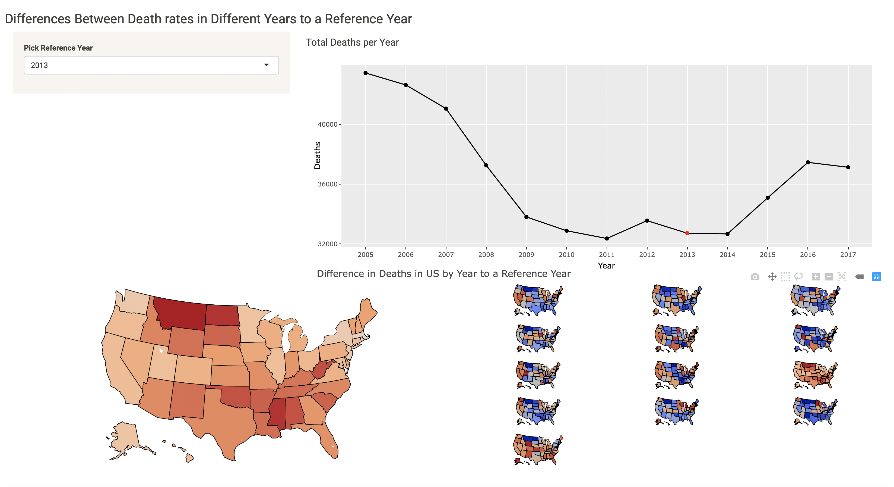
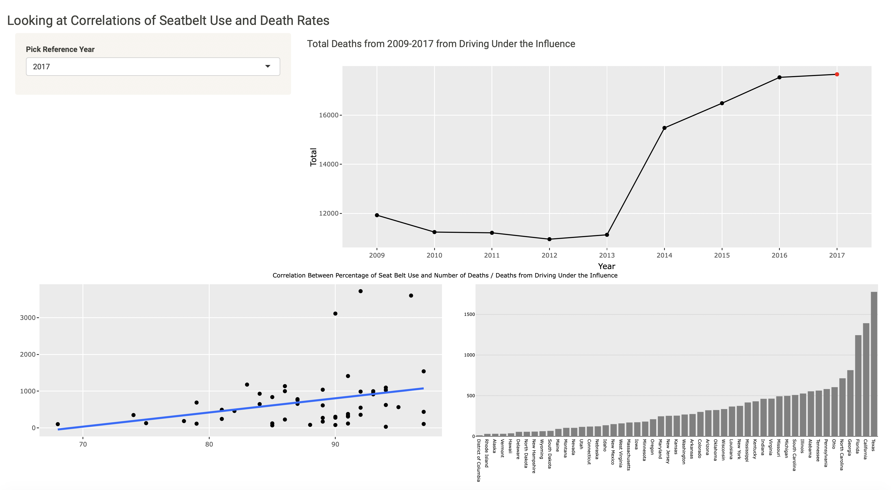
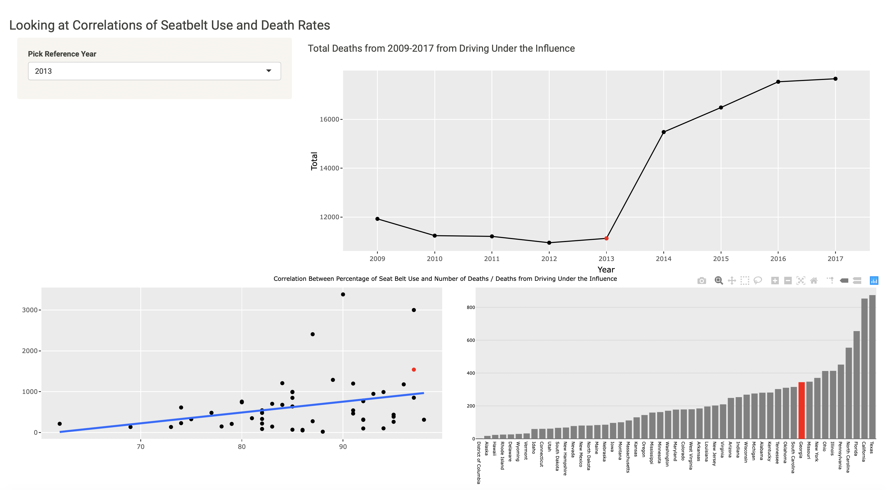

```{r setup, include=FALSE}
knitr::opts_chunk$set(echo = TRUE)
library(tidyverse)
library(ggplot2)
```

## Team Members
#### 4/4/19

Maria Nakhoul, Eliana Marostica, and Sunny Mahesh

## Data Set
#### 4/11/19

We will be using 3 data sets freely available online from the CDC

```{r load}
setwd("../")
iddr <- read_csv("data/Impaired_Driving_Death_Rate__by_Age_and_Gender__2012___2014__All_States.csv")
ocdr <- read_csv("data/Motor_Vehicle_Occupant_Death_Rate__by_Age_and_Gender__2012___2014__All_States.csv")
sebt <- read_csv("data/Percentage_of_Drivers_and_Front_Seat_Passengers_Wearing_Seat_Belts__2012___2014__All_States.csv")
```

#### Impaired Driving Death Rates by Age and Gender (2012 & 2014)

Summarize the variables, data types (temporal, networks, multivariate matrices, etc.),
and key statistics (# of elements, # of attributes, # of timepoints, etc.) of your data set.

The key variables here are state, location (of the state), age group (all,0-20, 21-34, 35+), year (2012,2014), sex, and death rate. The data type here is numeric - these are death rates. There are two timepoints: 2012 and 2014. These death rates are available for each of the 50 states plus Washington D.C. and the United Sates as a whole.


```{r}
iddr %>%
  summary()
```


#### Motor Vehicle Occupant Death Rates by Age and Gender (2012 & 2014)

```{r}
ocdr %>%
  summary()
```


There are two time points for the OCDR data 2012 and 2014. There are 2 main attributes sex and age. There are 52 elements (50 states, DC, and USA as a whole). All of the data is numeric data, where the values are the number of deaths for that specific category.

#### Percentage of Drivers and Front Seat PAssengers Wearing Seat Belts

```{r}
sebt %>%
  summary()
```

```{r}
indicies_max_2012<-which(sebt$`2012`==max(sebt$`2012`))
sebt[indicies_max_2012,]
indicies_min_2012<-which(sebt$`2012`==min(sebt$`2012`))
sebt[indicies_min_2012,]
indicies_max_2014<-which(sebt$`2014`==max(sebt$`2014`))
sebt[indicies_max_2014,]
indicies_min_2014<-which(sebt$`2014`==min(sebt$`2014`))
sebt[indicies_min_2014,]
```

In 2012, the state with the maximum number of drivers and front seat passangers wearing a seat belt are Washington and Oregon, while the state with the minimum number is South Dakota.


In 2014, the state with the maximum number of drivers and front seat passangers wearing a seat belt is Oregon, while the state with the minimum number is South Dakota.


## Visualization Tasks and Requirements
#### 4/18/19

  1. Describe what kind of information can be derived through exploratory visualization analysis of the data set. The information we can derive from our dataset are:
    a. Geographical data 
    b. Temporal data
    c. Age stratification
    d. Gender stratification
    e. Correlations
  2. Identify the target audience for the visualization tool that you will build. Target audience:
    a. Insurance Companies 
    b. CDC
    c. DMV
    d. General Audience
    e. Policy Makers
  3. Develop a list of visualization tasks for the data set. Visualizations:
    a. Correlation Heatmap
    b. US Choropleth Map by state by year or age
    c. US Choropleth Map by designated regions (ie: Midwest, west, etc) 
    d. Boxplots to show statistics when you click on a state
    e. Hover over maps and show data


## Sketches and 5 Design Sheets
#### 4/25/19

Many of our sketches were done on whiteboards, but we have copies of our 5 design sheets below.







*Edit 5/9/19: The 5 design sheets were made prior to the addition of the temporal dataset.


## Updates
#### 4/29/19

We have now added temporal data to our datasets. An updated, comprehensive explanation of our datasets is below.

The data we are using for this dataset consists of several parts. All the parts fall under motor vehicle induced deaths, for 2 different sources. The first source is the CDC.  The data obtained from the CDC are 3 datasets, Impaired Driving Death Rate by Age and Gender 2012 & 2014 All States, Passengers Wearing Seat Belts 2012 & 2014 All States, Motor Vehicle Occupant Death Rate by Age and Gender 2012 & 2014 All States. Datasets are divided up by all the states and death rates divided by age in the following categories: All Ages, Age 0-20, Age 21-34, Age 35-54, Age 55+, as well as by gender, Male or Female, for the years 2012 and 2014. Impaired driving death rates contains death rate data calculated per state per 100,00 population of individuals who had BAC =>0.08%1. Passengers wearing seat belts contained the percentage of seat belt wearing individuals. The data was collected from the National Occupant Protection Use Survey (NOPUS)2. Motor vehicle occupant death rate contained death rage by age or gender per 100,000 population. Data was collected by Fatality Analysis Reporting System (FARS) in 2012 and by National Highway Traffic Safety Administration's (NHTSA) and Fatality Analysis Reporting System (FARS)3. 

Since we didn't have enough temporal data, we used another source to obtain more data which was, the Insurance Institute for Highway Safety Highway Loss Data Institute. We were able to use this data since it was collected from the same source as the data in the CDC datasets, FARS4. From this website we collected the fatal crash totals which contained all states, number of deaths, and deaths per 100,000 population. The temporal problem was fixed because we were able to obtain the same information for the years 2005 to 2017. Deaths by road user which broke down the total deaths in the previous dataset into the motor vehicle crash death per state, and if the occupant was in a car, pickup and SUV, large truck, motorcyclist, pedestrian, or a bicyclist. Restrain use was also obtained in order to get the percentage of observed seat belt use per state.

Our previous Visualization Tasks and Requirements:

  1. Describe what kind of information can be derived through exploratory visualization analysis of the data set. The information we can derive from our dataset are:
    a. Geographical data 
    b. Temporal data
    c. Age stratification
    d. Gender stratification
    e. Correlations
  2. Identify the target audience for the visualization tool that you will build. Target audience:
    a. Insurance Companies 
    b. CDC
    c. DMV
    d. General Audience
    e. Policy Makers

The first and second requirement points would stay the same. The data is of interest to the same audience, and the same types of information are derived from the 2 datasets since they were collected by the same source (FARS) initially. Our third requirement has changed though due to more time points in our data.

  3. Develop a list of visualization tasks for the data set. Visualizations:
    a. Correlation Scatter Plot
    b. US Choropleth Map by state by year or age
    c. US Choropleth Map similarity between all the years and enlarge a specific year to look at
    d. Boxplots to show statistics when you click on a state
    e. Hover over maps and show data
    f. Line graphs to show trends over time.
    g. Small Multiples


New Data Summary Statistics

```{r}
#install.packages("rio")
library(rio)
setwd("../")
fatal_car_crashes<-import_list("data/fatal car_crash.xlsx",setclass = "tbl",rbind = TRUE)
deaths_by_road_users<-import_list("data/Deaths by road users.xlsx",setclass="tbl",rbind=T)
indicies=c()

for( i in 1:13){
  indicies[i]=52*i
}
deaths_car_crashes=fatal_car_crashes[-indicies,]

line_graph<-fatal_car_crashes[indicies,]
colnames(line_graph)=c("State","Population","Deaths","Deaths_per_100000_Population","Year")
line_graph$Year=c("2017","2016","2015","2014","2013","2012","2011","2010","2009","2008","2007","2006","2005")

na_indicies=which(is.na(deaths_by_road_users$State))
deaths_by_road_users=deaths_by_road_users[-na_indicies,]
road_users_deaths=deaths_by_road_users[-indicies,]

year=c(rep(2017,51),rep(2016,51),rep(2015,51),rep(2014,51),rep(2013,51),rep(2012,51),rep(2011,51),rep(2010,51),rep(2009,51),rep(2008,51),rep(2007,51),rep(2006,51),rep(2005,51))

deaths_car_crashes=deaths_car_crashes[,1:4]
deaths_car_crashes$Year=year

road_users_deaths_column_names=c("State","Car_Occupant_Death_Number","Car_Occupant_Death_Percent","Pickup_and_SUV_Occupant_Death_Number","Pickup_and_SUV_Occupant_Death_Percent","Large_Truck_Occupant_Death_Number","Large_Truck_Occupant_Death_Percent","Motorcyclists_Occupant_Death_Number","Motorcyclists_Occupant_Death_Percent","Pedestrians_Occupant_Death_Number","Pedestrians_Occupant_Death_Percent","Bicyclists_Occupant_Death_Number","Bicyclists_Occupant_Death_Percent","Total_Occupant_Death_Number","Total_Occupant_Death_Percent","Year")
colnames(road_users_deaths)=road_users_deaths_column_names
road_users_deaths$Year=year

```

```{r}

head(road_users_deaths%>%group_by(State)%>%summarize(n=as.integer(max(Car_Occupant_Death_Number)))%>%arrange(desc(n)))
head(road_users_deaths%>%group_by(State)%>%summarize(n=as.integer(max(Pickup_and_SUV_Occupant_Death_Number)))%>%arrange(desc(n)))
head(road_users_deaths%>%group_by(State)%>%summarize(n=as.integer(max(Large_Truck_Occupant_Death_Number)))%>%arrange(desc(n)))
head(road_users_deaths%>%group_by(State)%>%summarize(n=as.integer(max(Motorcyclists_Occupant_Death_Number)))%>%arrange(desc(n)))
head(road_users_deaths%>%group_by(State)%>%summarize(n=as.integer(max(Pedestrians_Occupant_Death_Number)))%>%arrange(desc(n)))
head(road_users_deaths%>%group_by(State)%>%summarize(n=as.integer(max(Bicyclists_Occupant_Death_Number)))%>%arrange(desc(n)))
head(road_users_deaths%>%group_by(State)%>%summarize(n=as.integer(max(Total_Occupant_Death_Number)))%>%arrange(desc(n)))
summary(road_users_deaths)

```

Car Occupant Death Number seems to show the most deaths over the years contribute largely from Texas, California and Florida. 

```{r}
colnames(deaths_car_crashes)=c("State","Population","Deaths","Deaths_per_100000_Population","Year")
head(deaths_car_crashes%>%group_by(State)%>%summarize(n=as.integer(max(Deaths_per_100000_Population)))%>%arrange(desc(n)))
head(deaths_car_crashes%>%group_by(State)%>%summarize(n=as.integer(max(Deaths)))%>%arrange(desc(n)))
summary(deaths_car_crashes)
```

Interestingly, most of the deaths occured in Texas, California and Florida, when you look at the maximum deaths per 100,000 Population, Wyoming, Mississippi, and Montana has the highest rates. This could be due to the fact that Texas, California and Florida are large states and so have a high population which would be the reason why the high death numbers were weighted out due to the population size.

We didn't recreate all the 5 design sheets, however we did create an idea sheet and sketches for the new dataset.



## Contributions
#### 5/9/2019

All members contributed equally to the design and production processes. Most of the design and coding was performed together with all group members present, therefore assessing specific contributions of each member is difficult. It should be noted, however, that Maria Nakhoul championed the debugging efforts on many of the visualizations, and all team members agree that she deserves recognition for her efforts and success there. Discussion regarding complex debugging and cleaning of the code also happened together.


## Screenshots and Captions
#### 5/9/19

The Navigation Bar in our visualization that helps us switch between the different tabs in our visualization.


The first tab of our visualization focuses on the CDC data for Morto Vehicle Death Rates in 2012 and 2014.
CDC data was stratified by Age, Gender and Year, so we were able to create boxplot distributions for the data to visualize the differences between 2012 and 2014. The bar plot represents death rate per 100,000 Population in all the states in increasing order for a specific year. The choropleth map is a visualization of the death rate portrayed in the bar plot. 



You can click on a boxplot and it will change in color to be highlighted and filter the data based on your selection and even update the side bar panel. Under the boxplots, a label of the boxplot you chosen gets displayed. If you click on a bar in the barplot it will highlight the corresponding state in the choropleth map and vice versa.



The second tab of our visualization is the comparison between a reference year choropleth map and a selected map from the small multipled for the Highway Loss Data Institue dataset for the death rates per 100,000 population per state for the years 2005-2017. The small multiples help to visualize the data all at once and make comparions. Under the small multiples, there is a label to select a small multiple to enlarge. After enlarging, it will tell you the year you have chosen to remind you.



Once you choose a reference year and a small multiple, the 2 choropleth maps appear side by side for comparison. Reference on the left and small multiple on the right. When you hover over the states in either map, or even the small multiples above, you get a bar plot of the Highway Loss Data Institue dataset on the vehicles involved in the death accident for the years 2005-2017. The death total in the 2 datasets is the same so we were able to make this link between the datasets for this visualization.



The third tab was the differences in the death rates between the years to a reference year. You choose a reference year and then the differences between all the years and the reference year (!reference-reference). The blue indicates negative values while the red indicates positive values. Ofcrouse one of the maps will remain red because we didn't subtract the reference from itself. We were unable to add a colorscale because due to the recursive function creating our small multiples, the colorscales would come up stacked ontop of each other and overlapped so you can't read the values displayed. The line graph represents the total number of deaths across all states across all the years, and when a reference year is chosen, the point for that year turns red.



The fourth tab shows the correlation scatter plot between percentage of seatbelt usage in the states for a reference year and the death rates for that year. The bar plot represents the death count from driving under the influence for a reference year by state. The line graph shows the total deaths caused by driving under the influence in the United States for the years 2009-2017. This tab was created as a way to find some connection between driving under the influence and death numbers even when using seat belts.



When you choose a reference year, that specific year point lights up in the line graph. The scatter plot and bar plot are filtered for that year as well. When you click on a bar in the bar plot, the corresponding point in the scatter plot appears as well. 



## Future Work
#### 5/9/19

Future work could look further into the unexpected correlation plots, mapping color to other potential contributors to motor-vehicle death rates: impaired driving rates, road conditions, etc. Would be interesting to find more data collected by FARS that hasn't been presented to the public, or even if there is stratification of the data the way the CDC had their data stratified by Age, Gender, and Year.

## References
#### 5/9/19

1-	https://www.cdc.gov/motorvehiclesafety/impaired_driving/states-data-tables.html

2-	https://www.cdc.gov/motorvehiclesafety/seatbelts/seatbelt_map.html

3-	https://data.cdc.gov/Motor-Vehicle/Motor-Vehicle-Occupant-Death-Rate-by-Age-and-Gende/rqg5-mkef

4-	https://www.iihs.org/iihs/topics/t/general-statistics/fatalityfacts/state-by-state-overview/2017